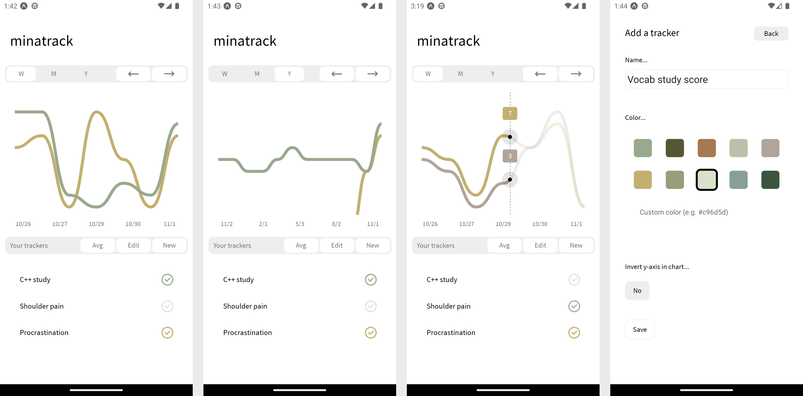

# minatrack

`minatrack` is a mobile app for plotting values on a 1-10 scale over time. 
It provides a simple and clean interface to track arbitrary data.

The app shows data in week, month, or year-long chunks. Days with multiple responses are aggregated into a single value, using either their average, maximum, or minimum.

Screenshots:

---

## Development Setup

To run the app via an emulator or physical device, use the Expo CLI and Expo Go:
[Installation instructions](https://docs.expo.dev/get-started/installation/).

Once installed, update the owner of the app to your Expo user name:
`app.json: expo.owner = username`.

Run `npm install` once and then `npx expo start` to run the app. The Expo Go mobile app will bundle and download the app based on the provided QR code.

Run unit tests with `npm run test`.

Run linting via ESLint with `npm run lint`.
